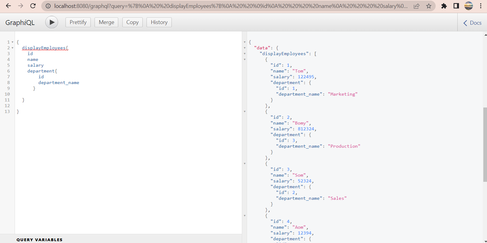
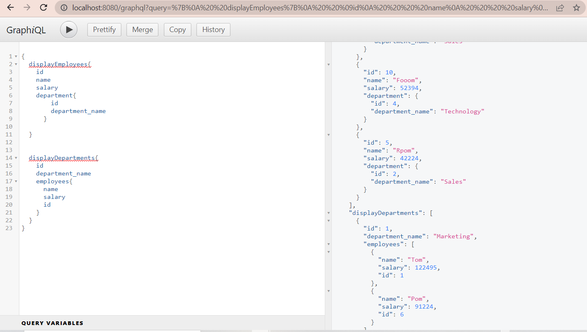
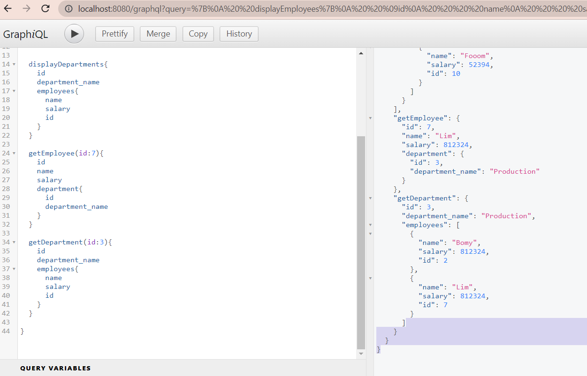

# Project: GraphQL
# Usage:

* git clone 
* npm i
* Graphql playground to test all queries and mutations

## Screenshots

### Achknowledments
[JSON Data API](https://www.onlinedatagenerator.com/)

#### Developed By:

Senior Tutor & Grader
Trilogy Education.

