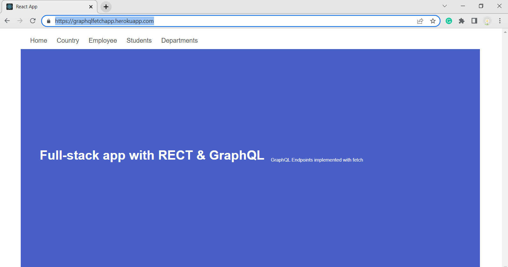

# Project: REACT with GraphQL full-stack app

## Deployment
[Live](https://graphqlfetchapp.herokuapp.com/)

### Usage Instructions 
* npm i 
* Graphql playground to test all queries and mutations

### Screenshots

GraphQL app with retrieval of data  using fetch

### Achknowledments
[JSON Data API](https://www.onlinedatagenerator.com/)

#### Developed By:

Senior Tutor & Grader
Trilogy Education.

